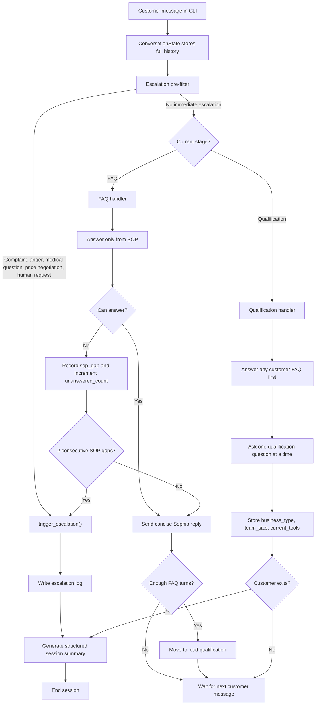

# Closira AI Agent - Bloom Aesthetics Clinic

[](#setup)
[](#running-the-agent)
[](#provider-configuration)
[](#reliability-and-safety)

A production-minded Python CLI prototype for Closira, an AI-powered customer communication platform for SMBs. The agent simulates customer support for a fictional UK aesthetics clinic and demonstrates a full 4-stage AI workflow: FAQ answering, lead qualification, escalation detection, and conversation summary.

The project is intentionally small, but the design is built around the things senior engineers care about: clear stage separation, prompt discipline, safe SOP boundaries, structured model output, deterministic guardrails, logging, and clean documentation.

## At A Glance

| Area | Implementation |
|---|---|
| Business | Bloom Aesthetics Clinic |
| Interface | Python command-line chat |
| Knowledge source | `data/sop.json` |
| Model support | OpenAI, Anthropic Claude, Groq, Hugging Face, Qwen, OpenRouter, Together, Fireworks, or any OpenAI-compatible API |
| Safety model | SOP-only answers, JSON outputs, escalation pre-filter, SOP gap threshold |
| Runtime logs | `logs/session_{session_id}.json` and `logs/escalation_{session_id}.json` |
| Test evidence | `test_transcripts/` contains one transcript per expected behaviour |

## Workflow Diagram



## Four Stages

### 1. FAQ Answering

The FAQ stage answers customer questions using only the SOP in `data/sop.json`. The assistant can answer questions about:

- Clinic hours
- Services listed in the SOP
- Botox starting price
- Dermal filler starting price
- Free initial consultations
- Booking channels
- Cancellation and rescheduling policy

If the SOP does not contain the answer, the agent does not guess. It records a `sop_gap` and gives a safe handoff-style response.

### 2. Lead Qualification

After the initial FAQ flow, the agent asks qualification questions one at a time:

1. Business type or industry
2. Team size
3. Current customer communication tools

The answers are stored in `ConversationState.qualification`. If the customer asks another FAQ during qualification, the agent answers the FAQ first and then continues qualification only when needed.

### 3. Escalation Detection

Escalation runs before every stage handler. It detects:

- Angry or frustrated sentiment
- Complaints
- Medical or health questions
- Pricing negotiation or discount requests
- Explicit requests for a human, manager, or real person
- Repeated SOP gaps

All escalation events are logged immediately with the session id, reason, timestamp, turn count, unanswered count, and SOP gaps.

### 4. Conversation Summary

At the end of a session, the summariser produces a structured summary for the business team:

- Customer intent
- Lead details collected
- Topics covered
- SOP gaps
- Escalation status and reason
- Recommended next action
- Overall sentiment
- Qualification status

## Repository Structure

```text
closira-agent/
├── main.py                         # CLI entry point and conversation loop
├── agent/
│   ├── __init__.py
│   ├── escalation.py               # Provider adapter, escalation classifier, logging
│   ├── sop.py                      # SOP loader and prompt formatter
│   ├── stages.py                   # FAQ and qualification stage logic
│   ├── state.py                    # ConversationState dataclass
│   └── summariser.py               # Final summary generation and session logs
├── data/
│   └── sop.json                    # Business SOP data
├── logs/
│   └── .gitkeep                    # Runtime JSON logs are ignored by Git
├── test_transcripts/
│   ├── 01_in_scope_question.md
│   ├── 02_out_of_scope_question.md
│   ├── 03_escalation_trigger.md
│   ├── 04_lead_qualification.md
│   └── 05_conversation_summary.md
├── prompt_design.md                # Prompt strategy and design reasoning
├── README.md
├── requirements.txt
└── .env.example
```

## Setup

Requirements: Python 3.9+

```bash
git clone https://github.com/shivambhartiya/closira-agent.git
cd closira-agent
pip install -r requirements.txt
cp .env.example .env
```

Edit `.env` and add your provider details. Do not commit `.env`.

## Provider Configuration

The project uses provider-neutral `LLM_*` variables. You can switch models without changing code.

### Groq / Llama

```env
LLM_PROVIDER=openai_compatible
LLM_API_KEY=your_groq_api_key_here
LLM_MODEL=llama-3.1-8b-instant
LLM_BASE_URL=https://api.groq.com/openai/v1
```

### OpenAI

```env
LLM_PROVIDER=openai
LLM_API_KEY=your_openai_api_key_here
LLM_MODEL=gpt-4.1-mini
```

### Anthropic Claude

```env
LLM_PROVIDER=anthropic
LLM_API_KEY=your_anthropic_api_key_here
LLM_MODEL=claude-sonnet-4-20250514
```

### Hugging Face / Qwen / Other OpenAI-Compatible APIs

```env
LLM_PROVIDER=openai_compatible
LLM_API_KEY=your_provider_api_key_here
LLM_MODEL=Qwen/Qwen2.5-72B-Instruct
LLM_BASE_URL=https://router.huggingface.co/v1
```

Legacy variables such as `OPENAI_API_KEY`, `OPENAI_MODEL`, `ANTHROPIC_API_KEY`, and `ANTHROPIC_MODEL` are also supported, but `LLM_*` is recommended.

## Running The Agent

```bash
python main.py
```

On Windows:

```powershell
py -3 main.py
```

Type `bye`, `quit`, `done`, or `summary` to end the session and generate the final summary.

## Demo Commands

You can paste these flows into the CLI to show each expected behaviour.

### In-SOP Question

```text
What are your Botox prices?
bye
```

### Out-of-Scope SOP Gaps

```text
do you offer laser hair removal
what about teeth whitening
bye
```

### Escalation Trigger

```text
i had your previous service it was pathetic and i want my money back
```

### Lead Qualification

```text
what services do you offer
how much are fillers
i run a dental clinic
about 8 people
we use whatsapp and email
bye
```

### Conversation Summary

```text
What are your Botox prices?
Do you offer free consultations?
What are your opening hours?
i would like to know the cost of 12 unit botox
tech
5
insta
bye
```

## Test Transcript Evidence

| File | Behaviour shown |
|---|---|
| `test_transcripts/01_in_scope_question.md` | In-SOP Botox pricing answer |
| `test_transcripts/02_out_of_scope_question.md` | SOP gaps and forced escalation after 2 consecutive unanswered questions |
| `test_transcripts/03_escalation_trigger.md` | Complaint escalation with logged reason |
| `test_transcripts/04_lead_qualification.md` | One-question-at-a-time qualification and stored lead fields |
| `test_transcripts/05_conversation_summary.md` | Full summary block at session end |

## Reliability And Safety

The project combines model instructions with application-level guardrails:

- SOP text is injected into every model call.
- Every model call goes through `call_llm()` in `agent/escalation.py`.
- Model responses are requested as JSON objects, not free-form prose.
- JSON parse failures return a safe fallback object instead of crashing.
- The pre-filter checks escalation triggers before normal stage handling.
- FAQ and qualification state are stored in `ConversationState`.
- Qualification fields are never recorded as SOP gaps.
- Two consecutive SOP gaps force escalation in Python code.
- Escalation and session logs are saved under `logs/`.
- `.env`, runtime JSON logs, Python cache files, and local secrets are ignored by Git.

## Key Design Decisions

| Decision | Why it matters |
|---|---|
| Provider-neutral adapter | The same workflow can run with OpenAI, Anthropic, Groq, Qwen, or other OpenAI-compatible APIs. |
| Structured JSON output | The app can make deterministic decisions from `can_answer`, `sop_gap`, `escalate`, and `confidence`. |
| SOP injection on every call | The model does not rely on memory or stale context for business facts. |
| Dual-layer escalation | A focused classifier catches urgent cases before the main stage prompt runs. |
| Deterministic guardrails | Known high-risk cases like booking, pricing negotiation, and SOP gaps are corrected in code when needed. |
| Logged summaries | The business receives a useful handoff record after each session. |

## Known Limitations

- This is a CLI prototype, not a WhatsApp, email, or phone integration.
- Sessions are not persisted to a CRM.
- SOP data is a static JSON file rather than a CMS or database.
- Qualification questions are fixed and sequential.
- Open-source or smaller hosted models can be less reliable with JSON output than larger frontier models.
- Production would add retry/backoff, observability, authentication, and webhook-based channel integrations.

## Submission Checklist

- Code is clearly structured under `agent/`
- `prompt_design.md` documents the system prompt, hallucination prevention, escalation logic, and persona
- `test_transcripts/` contains all required sample conversations
- `README.md` explains setup, running, workflow, design trade-offs, and limitations
- `.env.example` shows safe provider configuration without hardcoded keys
- Runtime logs are ignored, while `logs/.gitkeep` keeps the directory in Git
